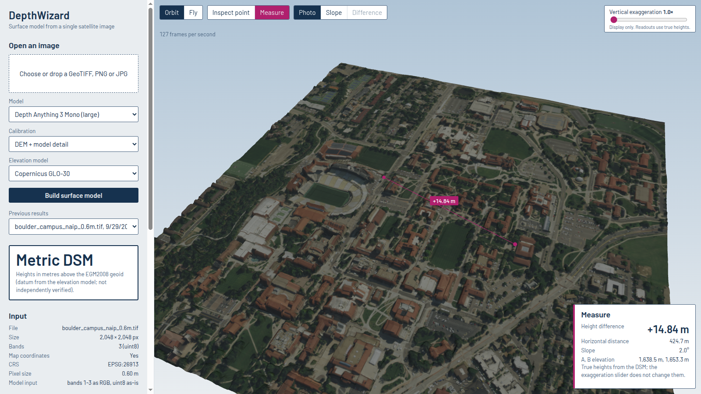

# DepthWizard

**One satellite or aerial image in, a 3D surface model out.** DepthWizard estimates a digital surface model (DSM) from a single RGB image and shows it as a textured 3D terrain you can fly through, inspect and measure.

- **GeoTIFF input** (the image has map coordinates) gives a **metric DSM** in metres. It's calibrated against a free global elevation model (Copernicus GLO-30), and the output GeoTIFF records its vertical datum.
- **PNG or JPG input** (no map coordinates) gives a **relative surface**. It shows shape only and is never labelled in metres.

Built for Smart India Hackathon 2026, problem statement 26175 (ISRO: single-image DSM; evaluation imagery is Cartosat-2S). Measured accuracy against independent LiDAR is in [docs/results.md](docs/results.md). How it works and why is in [docs/technical_report.md](docs/technical_report.md).



## Requirements

| | Tested on | Minimum |
|---|---|---|
| OS | Ubuntu 24.04 | Linux x86-64 |
| GPU | NVIDIA RTX 3050 Laptop, 6 GB, driver 595 | Any CUDA 12 GPU with ≥ 4 GB. A CPU works but is about 80× slower for the large model. |
| RAM | 16 GB | not formally measured. All runs here worked with about 5–10 GB available. |
| Disk | `.venv` 8.5 GB (hardlinked with uv's download cache) + 1.4 GB model weights | about 12 GB free |
| Internet | Needed for setup, the first model download and the first elevation download per area | Offline afterwards |

`nvidia-smi` must list your GPU. If it fails after a kernel update, the NVIDIA module for your kernel is probably missing: `sudo apt install linux-modules-nvidia-595-open-$(uname -r)`, then reboot.

## Install (once)

```bash
git clone <repository-url> DepthWizard
cd DepthWizard
bash setup/setup_env.sh
```

`setup_env.sh` creates `.venv` with Python 3.11 and PyTorch (CUDA 12.6). It also clones and installs Depth Anything 3 at a pinned commit, and writes `setup/requirements.lock.txt` and `setup/provenance.txt`. The first run downloads about 6 GB and takes 10–20 minutes. It is safe to run again.

On a slow or unstable connection, run it again: downloads are cached and resume where they stopped. `UV_HTTP_TIMEOUT=600` makes it more patient.

## Run

```bash
bash scripts/run_app.sh
```

Your browser opens `http://127.0.0.1:8000/app/`. Stop the app with Ctrl+C. Other ports: `DW_PORT=8080 bash scripts/run_app.sh`.

### Get a sample image

If you don't have a GeoTIFF at hand, cut a 1.2 km, 0.6 m window from public-domain USDA NAIP imagery (anonymous access, about 10 MB):

```bash
PYTHONPATH=src .venv/bin/python scripts/fetch_naip_window.py --lon -105.266 --lat 40.007 --size 2048 --out data/samples
```

### Use the viewer

1. **Open an image.** Drop a GeoTIFF, PNG or JPG and choose **Build surface model**. The recommended settings are preselected: Depth Anything 3 Mono, "DEM + model detail", Copernicus GLO-30. A 2048 × 2048 GeoTIFF took 16–35 s on the RTX 3050 once the app was warm. The very first build after starting the app took about 64 s, because it loads the model and fetches the elevation data.
2. **Read the stamp.** *Metric DSM* means heights in metres above the named datum. *Relative surface* means the heights have no units.
3. **Look around.** *Orbit* (drag, scroll) or *Fly* (click the view, then W A S D to move, Q E to go down and up, Shift to go faster, Esc to stop).
4. **Inspect point** shows the elevation from the DSM itself. The ground estimate and height above ground are shown too, but they are **derived and rough**: see [results §5](docs/results.md).
5. **Measure** gives the height difference, horizontal distance and slope between two clicks.
6. **Slope** colours the surface by steepness.
7. **Compare with a reference.** Upload a reference DSM GeoTIFF (for example a LiDAR survey) to get bias, MAE, RMSE and correlation, plus a *Difference* overlay.
8. **Vertical exaggeration** changes only the display. Every readout uses true heights.
9. **Export** the DSM GeoTIFF, the relative GeoTIFF, the DEM on your image grid, the mesh (GLB), metadata, the calibration report, or a screenshot.

### Use the API directly

```bash
curl -F file=@data/samples/<image>.tif http://127.0.0.1:8000/jobs              # -> {"id": "...", "status": "queued"}
curl http://127.0.0.1:8000/jobs/<id>                                           # status, progress, metadata
curl -o dsm.tif  http://127.0.0.1:8000/jobs/<id>/files/dsm.tif                 # also: rdsm.tif dem.tif ground.tif mesh.glb
curl "http://127.0.0.1:8000/jobs/<id>/point?row=1024&col=1024"                 # elevation at a pixel (or ?x=..&y=.. in map units)
```

Form fields for `POST /jobs`:
- `model`: `da3_mono_large` or `da2_small`
- `calibration`: `dem_plus_smooth_residual` (default), `dem_plus_residual`, `dem_only` or `robust_affine`
- `dem_source`: `copernicus` (default), `nasadem` (SRTM, NASADEM reprocessing) or `skadi` (Tilezen blend; over the USA it is 3DEP bare earth, not SRTM). Every metric GeoTIFF records the choice in its `CALIBRATION_DEM` tag. Calibrate to the DEM the scorer uses: it matters more than the model (docs/reference_choice.md).

Jobs run one at a time, because there is a single GPU.

## What the outputs mean

| File | Content | Units / datum |
|---|---|---|
| `dsm.tif` | Calibrated surface heights, on exactly the input's grid (same CRS, transform and size) | metres, datum of the elevation model (Copernicus: EGM2008) |
| `rdsm.tif` | Raw model output, oriented so higher = taller | relative (no units) |
| `dem.tif` | The elevation model resampled (bilinear) onto your grid | metres, same datum |
| `ground.tif` | **Derived** crude ground (30 m morphological opening). Not reliable under continuous forest. | metres |
| `mesh.glb` | Textured display mesh (at most 512 × 512 vertices) plus a coarse LOD. For display, not measurement. | local metres from the image corner |

Each GeoTIFF carries tags `DSM_KIND`, `UNITS`, `VERTICAL_DATUM`, `MODEL` and `CALIBRATION`, plus a JSON sidecar.

## How it works

```
                 ┌───────────────────────── depthwizard (Python package, no web code) ──────────────────────────┐
 image ─▶ io.read_raster ─▶ tiling.run_tiled ─▶ depth (DA3 / DA-V2) ─▶ relative height R
   │                                                                          │
   └─▶ geo.footprint ─▶ geo.dem.fetch_dem_window (Copernicus COG window) ─▶ geo.reproject ─▶ DEM D on image grid
                                                                              │
                        calibration: Z = D + a·(R − lowpass₃₀ₘ(R))   (a fitted robustly at DEM scale)
                                                                              │
                        export.export_dsm (GeoTIFF + tags) · reconstruction.export_glb (mesh) · evaluation
                 └─────────────────────────────────────────────────────────────────────────────────────────────┘
 backend/app.py (FastAPI: job queue, files, point queries)  ◀──HTTP──▶  frontend/ (Three.js viewer, vendored, offline)
```

The DEM supplies absolute heights at 30 m. The monocular model supplies only the fine structure (buildings, trees), with its own mean removed at the DEM's scale. Measured against independent LiDAR, this beats the plain DEM by 18 % in urban terrain, 6 % in steep forest and 2.5 % on open land ([results](docs/results.md)). The technical report explains why other combinations fail.

## Reproduce the results

| Step | Command | Output |
|---|---|---|
| Unit tests (68) | `PYTHONPATH=src .venv/bin/python -m unittest discover -s tests` | all pass, offline |
| Hardware check | `.venv/bin/python scripts/check_hardware.py` | `runs/env/hardware.json` |
| Model smoke test | `PYTHONPATH=src .venv/bin/python experiments/00_smoke/smoke_test_models.py --image <png/tif> --fp16` | `runs/smoke/…/report.json` |
| Experiment 0 (2 sites) | `PYTHONPATH=src .venv/bin/python experiments/04_exp0/fetch_sites.py && PYTHONPATH=src .venv/bin/python experiments/04_exp0/run_exp0.py` | `runs/exp0/…` |
| Stratified validation (3 sites × 3 GSDs) | `PYTHONPATH=src .venv/bin/python experiments/08_stratified/fetch_sites8.py && PYTHONPATH=src .venv/bin/python experiments/08_stratified/run_stratified.py && .venv/bin/python experiments/08_stratified/make_results_md.py runs/exp8/<run>` | `docs/results.md` |
| GAMUS subset + audit | `PYTHONPATH=src .venv/bin/python scripts/fetch_gamus_subset.py --split test --per-city 10` then `experiments/02_gamus_audit/audit_gamus.py` | `docs/gamus_audit.md` |
| Fine-tune sanity run (local) | `PYTHONPATH=src .venv/bin/python training/finetune.py --config configs/finetune_da2_small_local.yaml` | `runs/finetune/…/metrics.json` |
| Fine-tune DA3 (Kaggle) | `bash scripts/make_kaggle_bundle.sh`, upload `dist/depthwizard-code.zip` as a Kaggle Dataset, run `notebooks/finetune_da3_kaggle.ipynb` | `best.pt` + sha256 |
| Optional ONNX export | `PYTHONPATH=src .venv/bin/python scripts/export_onnx.py --model da2_small` (DA3: add `--no-sky-postprocess`) | `models/*.onnx` + equivalence report |
| Viewer screenshots | `DISPLAY=:0 PYTHONPATH=src .venv/bin/python scripts/ui_screenshots.py --metric-job … --forest-job … --png-job …` | `docs/screenshots/` |

The dev tools (Playwright, ONNX) are in `setup/requirements-dev.txt`. Every run directory records its config, seed and provenance.

## Licenses

| Component | License | Notes |
|---|---|---|
| DepthWizard code | **not yet chosen**: add a `LICENSE` file before publishing | |
| Depth Anything 3 Mono Large (`depth-anything/DA3MONO-LARGE`) and its code | Apache-2.0 | Verified on the HF card. Checkpoint sha256 recorded. |
| Depth Anything V2 Small (`depth-anything/Depth-Anything-V2-Small-hf`) | Apache-2.0 | DA-V2 Base/Large and multi-view DA3 are CC-BY-NC and **not used** |
| Copernicus DEM GLO-30 | Copernicus DEM licence (free, attribution) | © DLR e.V. 2010-2014 and © Airbus Defence and Space GmbH 2014-2018, provided under COPERNICUS by the European Union and ESA |
| NASADEM HGT v001 (optional DEM, SRTM) | NASA LP DAAC: no restrictions on reuse (cite) | via Microsoft Planetary Computer, anonymous |
| Tilezen terrain tiles (optional DEM) | attribution required | [joerd attribution](https://github.com/tilezen/joerd/blob/master/docs/attribution.md) |
| USDA NAIP imagery (validation, samples) | Public domain | |
| USGS 3DEP LiDAR (validation) | Public domain (USGS) | |
| ESA WorldCover (validation strata) | CC-BY-4.0 | © ESA WorldCover project / Contains modified Copernicus Sentinel data |
| GAMUS (training) | CC-BY-4.0 | [HF earthflow/GAMUS](https://huggingface.co/datasets/earthflow/GAMUS) |
| three.js 0.186.1 (vendored) | MIT | `frontend/vendor/three/LICENSE` |
| Barlow font (vendored) | SIL OFL 1.1 | `frontend/vendor/fonts/LICENSE-Barlow-OFL.txt` |

## Troubleshooting

- **`nvidia-smi` fails / CUDA not available:** the kernel module doesn't match the running kernel (see Requirements). Fix it, then run `DW_NO_CLAUDE=1 bash scripts/bootstrap.sh` to verify.
- **Setup stops with a download timeout:** run it again, since completed downloads are cached. Set `UV_HTTP_TIMEOUT=600`.
- **Setup stops with "DA3 install changed torch":** DA3's requirements pulled a different torch. Reinstall torch from the cu126 index and rerun. The script refuses to continue with a mismatched torch.
- **"Port 8000 is already in use":** `DW_PORT=8080 bash scripts/run_app.sh`.
- **Job fails at "fetching DEM" when offline:** the elevation data for that area was never downloaded. Connect once for that area. After that it is cached in `data/dem_cache/`.
- **Slow on a laptop GPU:** choose *Depth Anything V2 (small, fast)*. It is about 4–6× faster (44 vs 184 ms per 518 px tile), but less accurate, especially at coarse pixel sizes ([results §3](docs/results.md)).

## Project layout

```
src/depthwizard/     engine: io, geo/ (DEM fetch, reprojection, Planetary Computer), depth, tiling,
                     calibration, evaluation, export, reconstruction, pipeline
backend/app.py       FastAPI job queue + file / point API; serves frontend/
frontend/            Three.js viewer (index.html, style.css, app.js, vendor/)
training/            finetune.py (local DA-V2 and Kaggle DA3), with configs in configs/
experiments/         00_smoke, 01_geo_spine, 02_gamus_audit, 03_gamus_zeroshot, 04_exp0, 08_stratified
scripts/             run_app.sh, setup/fetch/export/screenshot tools
docs/                results.md, technical_report.md, gamus_audit.md, figures/, screenshots/
setup/               setup_env.sh, requirements*.txt, lockfile, provenance
tests/               68 unit and API tests (offline, fake model + fake DEM tiles)
```

## Developing with VS Code and Claude Code

Opening the folder in VS Code runs `scripts/bootstrap.sh` (after you allow automatic tasks). It initialises git, builds the environment once, runs the hardware check, and then starts Claude Code on the next unchecked phase in `CLAUDE.md`. Manual tasks are under *Ctrl+Shift+P → Tasks: Run Task*. `CLAUDE.md` holds the project rules and the phase checklist, with evidence for each completed phase.
