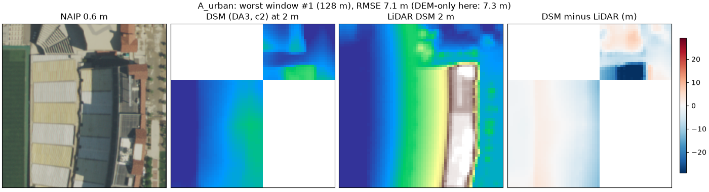
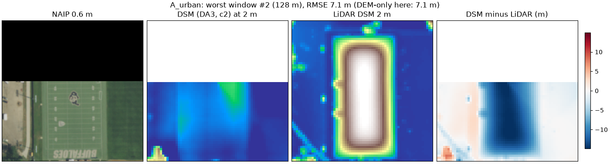
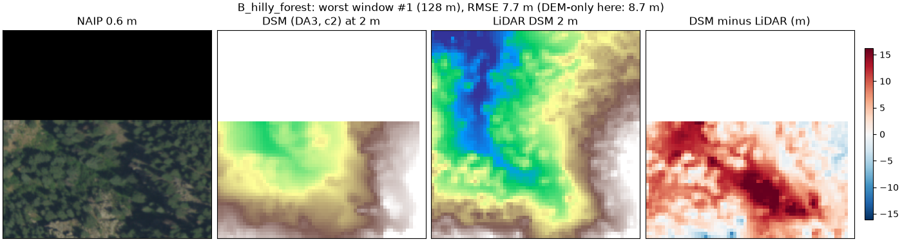
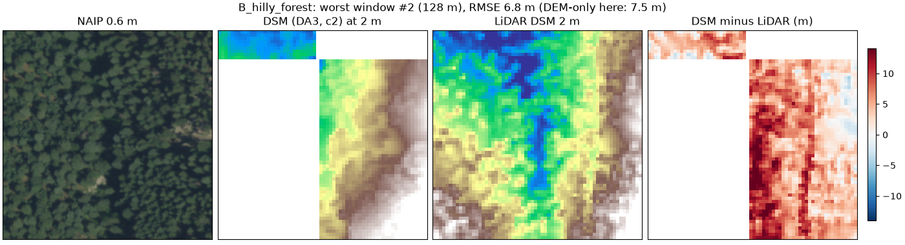
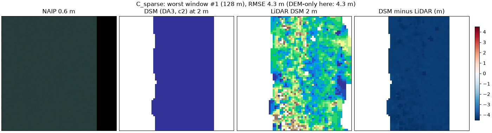
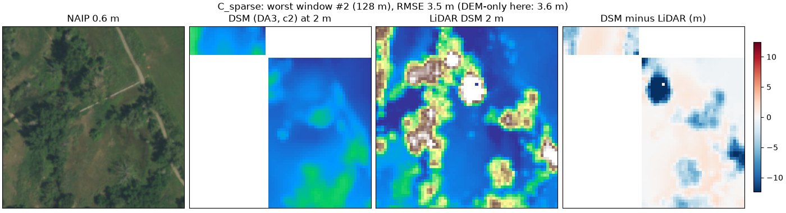
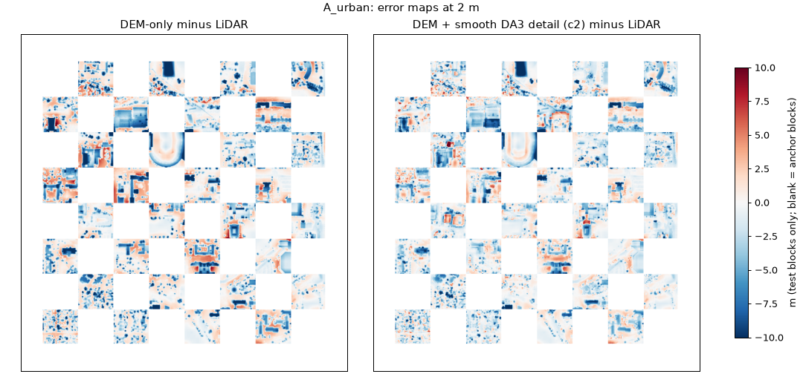
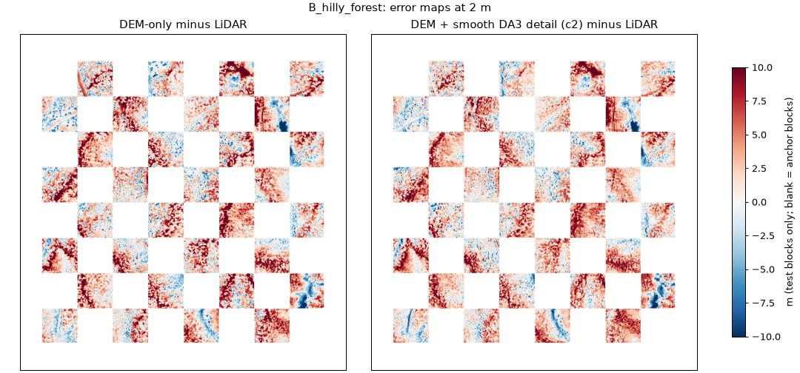
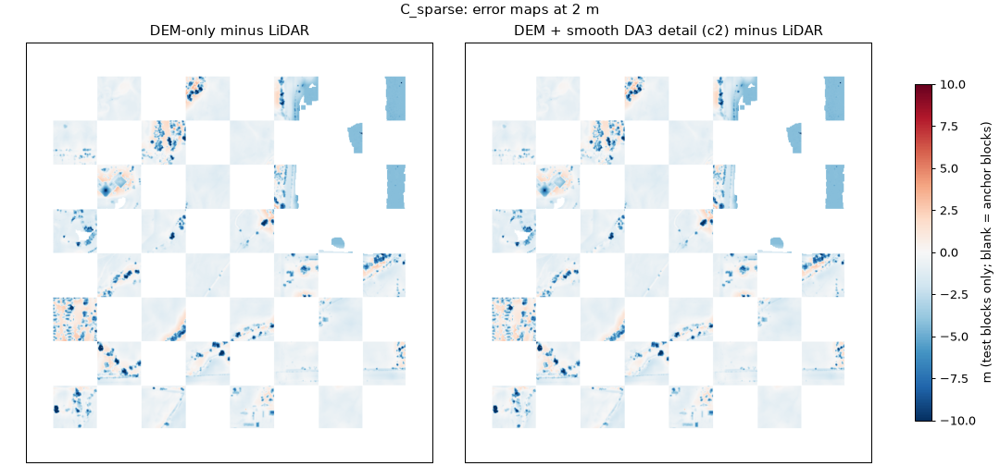

# DepthWizard: stratified validation results (Phase 8)

Source: `runs/exp8/20260929T145210Z/metrics.json`, config `configs/exp8.yaml`, seed 0. All tables below are generated from that file by `experiments/08_stratified/make_results_md.py`.

## Summary

Against an independent LiDAR DSM, the best method is **(c2): the Copernicus DEM plus DA3-Mono-Large detail, with the detail made zero-mean by a smooth 30 m low-pass**. It has the lowest RMSE at all three sites, measured on held-out test blocks:

- A urban (CU Boulder campus): 3.24 m vs DEM-only 3.95 m (-17.9 %)
- B hilly forest (Flatirons foothills): 4.38 m vs DEM-only 4.69 m (-6.6 %)
- C sparse (east Boulder open space): 2.10 m vs DEM-only 2.15 m (-2.3 %)

- The gain is largest where there are buildings and trees on flat or moderate ground. It shrinks on steep forest and is negligible on open grassland.
- The per-cell version (c) leaves 30 m steps at DEM cell edges. It **loses to DEM-only on steep forest** (see table 1). The smooth version (c2) fixes both the visual grid and the accuracy loss. The pipeline default is now (c2).
- (b), scaling the model output to the DEM alone, is unusable. Monocular depth from a near-nadir image does not carry absolute terrain.
- Accuracy has a floor set by the 30 m DEM. Every calibrated product inherits the DEM's bias (table 1: the bias is identical across (a), (c) and (c2)). The model only adds fine structure.

## Setup

| | |
|---|---|
| Imagery | USDA NAIP 2021, 0.6 m RGB, public domain (a stand-in for Cartosat-2S; see Limitations) |
| Independent reference | USGS 3DEP LiDAR 2013 (survey `USGS_LPC_CO_SoPlatteRiver_Lot5_2013_LAS_2015`): DSM and DTM, 2 m, NAVD88, **converted to EGM2008** (GEOID18 + EGM2008 grids via PROJ) before scoring |
| Calibration DEM | Copernicus GLO-30 (EGM2008; verified from the tile XML in Phase 10 A1) |
| Land-cover strata | ESA WorldCover 2021, 10 m, CC-BY-4.0. Urban = built-up; forest = tree cover; sparse = grass/crop/shrub/bare; water = water/wetland |
| Terrain strata | Slope of the LiDAR **DTM**, smoothed to ~10 m. Flat < 5°, moderate 5–15°, hilly ≥ 15°. Building walls are not counted as terrain. |
| Split | Checkerboard of 154 m blocks. Anchors (used to fit (b)'s scale, which (c) and (c2) reuse) and test blocks never overlap. Only test blocks are scored. |
| Scoring | Prediction area-averaged onto the reference grid. A cell counts only if it lies fully inside the image and ≥ 90 % of it is test pixels. |
| Bias note | Outputs and LiDAR are both EGM2008, so bias no longer contains a datum offset. It still includes the 2013 → 2021 time gap and Copernicus's own bias. `std` = RMSE with bias removed. |

## 0. Datum conversion: bias before and after (vs LiDAR DSM, 2 m, GSD 0.6 m)

Before: `runs/exp8/20260928T202021Z` (LiDAR left in NAVD88). After: this run (LiDAR converted to EGM2008). The geoid offset is the per-site range applied by PROJ.

| Site | Method | Offset NAVD88 → EGM2008 (m) | Bias before (m) | Bias after (m) | RMSE before → after (m) | std before → after (m) |
|---|---|---|---|---|---|---|
| A urban | (a) DEM only | +0.17 … +0.19 | -1.06 | -1.23 | 3.90 → 3.95 | 3.75 → 3.75 |
| A urban | (c2) DEM + detail, smooth DA3 | +0.17 … +0.19 | -1.06 | -1.23 | 3.18 → 3.24 | 3.00 → 3.00 |
| B hilly forest | (a) DEM only | +0.22 … +0.26 | 2.19 | 1.95 | 4.80 → 4.69 | 4.27 → 4.27 |
| B hilly forest | (c2) DEM + detail, smooth DA3 | +0.22 … +0.26 | 2.16 | 1.92 | 4.49 → 4.38 | 3.94 → 3.94 |
| C sparse | (a) DEM only | +0.17 … +0.18 | -0.98 | -1.15 | 2.06 → 2.15 | 1.81 → 1.81 |
| C sparse | (c2) DEM + detail, smooth DA3 | +0.17 … +0.18 | -0.98 | -1.15 | 2.01 → 2.10 | 1.75 → 1.75 |

- The bias moves by exactly the geoid offset and `std` is unchanged, so the model outputs are identical between runs. **The remaining biases (about −1.2 / +1.9 / −1.1 m) are not a datum effect.** They are Copernicus's own local bias plus the 2013 → 2021 time gap. The RMSE changes are only that bias shift.

## 1. Overall accuracy vs LiDAR DSM (2 m, GSD 0.6 m)

| Site | Method | Model | n | Bias (m) | MAE (m) | RMSE (m) | std (m) | r | R² |
|---|---|---|---|---|---|---|---|---|---|
| A urban | (a) DEM only | none | 185,740 | -1.23 | 2.70 | 3.95 | 3.75 | 0.967 | 0.928 |
| A urban | (b) model scaled to DEM | DA-V2 Small | 185,740 | -0.74 | 11.41 | 13.99 | 13.97 | 0.327 | 0.097 |
| A urban | (b) model scaled to DEM | DA3-Mono-Large | 185,740 | 0.71 | 8.81 | 11.47 | 11.45 | 0.629 | 0.393 |
| A urban | (c) DEM + detail, per-cell | DA-V2 Small | 185,740 | -1.24 | 2.46 | 3.66 | 3.44 | 0.972 | 0.938 |
| A urban | (c) DEM + detail, per-cell | DA3-Mono-Large | 185,740 | -1.24 | 2.30 | 3.41 | 3.18 | 0.976 | 0.946 |
| A urban | (c2) DEM + detail, smooth | DA-V2 Small | 185,740 | -1.24 | 2.38 | 3.56 | 3.34 | 0.974 | 0.941 |
| A urban | (c2) DEM + detail, smooth | DA3-Mono-Large | 185,740 | -1.23 | 2.18 | 3.24 | 3.00 | 0.979 | 0.952 |
| B hilly forest | (a) DEM only | none | 186,046 | 1.95 | 3.57 | 4.69 | 4.27 | 0.999 | 0.997 |
| B hilly forest | (b) model scaled to DEM | DA-V2 Small | 186,046 | -14.57 | 40.01 | 53.47 | 51.44 | 0.861 | 0.603 |
| B hilly forest | (b) model scaled to DEM | DA3-Mono-Large | 186,046 | -1.81 | 35.01 | 48.62 | 48.59 | 0.874 | 0.671 |
| B hilly forest | (c) DEM + detail, per-cell | DA-V2 Small | 186,046 | 1.93 | 3.69 | 4.82 | 4.41 | 0.999 | 0.997 |
| B hilly forest | (c) DEM + detail, per-cell | DA3-Mono-Large | 186,046 | 1.90 | 3.79 | 4.97 | 4.59 | 0.999 | 0.997 |
| B hilly forest | (c2) DEM + detail, smooth | DA-V2 Small | 186,046 | 1.94 | 3.46 | 4.52 | 4.09 | 0.999 | 0.997 |
| B hilly forest | (c2) DEM + detail, smooth | DA3-Mono-Large | 186,046 | 1.92 | 3.38 | 4.38 | 3.94 | 0.999 | 0.997 |
| C sparse | (a) DEM only | none | 164,651 | -1.15 | 1.32 | 2.15 | 1.81 | 0.941 | 0.836 |
| C sparse | (b) model scaled to DEM | DA-V2 Small | 164,651 | -1.75 | 4.79 | 5.91 | 5.64 | 0.008 | -0.241 |
| C sparse | (b) model scaled to DEM | DA3-Mono-Large | 164,651 | -2.71 | 4.59 | 5.97 | 5.31 | 0.088 | -0.265 |
| C sparse | (c) DEM + detail, per-cell | DA-V2 Small | 164,651 | -1.14 | 1.30 | 2.10 | 1.76 | 0.945 | 0.843 |
| C sparse | (c) DEM + detail, per-cell | DA3-Mono-Large | 164,651 | -1.15 | 1.30 | 2.09 | 1.75 | 0.945 | 0.845 |
| C sparse | (c2) DEM + detail, smooth | DA-V2 Small | 164,651 | -1.15 | 1.30 | 2.10 | 1.76 | 0.944 | 0.843 |
| C sparse | (c2) DEM + detail, smooth | DA3-Mono-Large | 164,651 | -1.15 | 1.30 | 2.10 | 1.75 | 0.945 | 0.844 |

## 2. Per-stratum accuracy vs LiDAR DSM (2 m, GSD 0.6 m)

Strata are pixel-level classes within each site. Strata with fewer than 500 cells are left out.

### Land cover

| Site | Stratum | n | DEM only: bias / MAE / RMSE / r | (c2) DA3: bias / MAE / RMSE / r | (c2) DA-V2: RMSE | Δ RMSE (c2 DA3 vs DEM) |
|---|---|---|---|---|---|---|
| A urban | urban | 124,026 | -1.31 / 2.81 / 4.16 / 0.959 | -1.34 / 2.27 / 3.42 / 0.974 | 3.78 | -17.7 % |
| A urban | forest | 41,784 | -1.42 / 3.02 / 3.95 / 0.979 | -1.28 / 2.39 / 3.19 / 0.987 | 3.46 | -19.4 % |
| A urban | sparse | 19,928 | -0.36 / 1.36 / 2.19 / 0.977 | -0.50 / 1.21 / 1.93 / 0.983 | 2.05 | -12.0 % |
| B hilly forest | forest | 185,202 | 1.96 / 3.58 / 4.70 / 0.999 | 1.93 / 3.39 / 4.39 / 0.999 | 4.53 | -6.6 % |
| B hilly forest | sparse | 824 | 0.23 / 1.67 / 2.25 / 0.995 | -0.46 / 1.55 / 2.09 / 0.996 | 2.32 | -7.0 % |
| C sparse | urban | 12,567 | -1.00 / 1.32 / 1.86 / 0.949 | -1.00 / 1.27 / 1.75 / 0.957 | 1.81 | -5.5 % |
| C sparse | forest | 15,359 | -2.00 / 2.60 / 3.62 / 0.769 | -1.94 / 2.47 / 3.47 / 0.794 | 3.46 | -4.4 % |
| C sparse | sparse | 127,220 | -0.86 / 0.98 / 1.51 / 0.972 | -0.87 / 0.97 / 1.47 / 0.974 | 1.47 | -2.3 % |
| C sparse | water | 9,505 | -3.84 / 3.84 / 4.85 / 0.317 | -3.84 / 3.85 / 4.86 / 0.316 | 4.87 | +0.1 % |

### Terrain slope (from LiDAR DTM)

| Site | Stratum | n | DEM only: bias / MAE / RMSE / r | (c2) DA3: bias / MAE / RMSE / r | (c2) DA-V2: RMSE | Δ RMSE (c2 DA3 vs DEM) |
|---|---|---|---|---|---|---|
| A urban | flat | 128,558 | -0.81 / 2.35 / 3.48 / 0.974 | -0.94 / 1.88 / 2.83 / 0.984 | 3.11 | -18.7 % |
| A urban | moderate | 35,616 | -1.71 / 3.13 / 4.32 / 0.963 | -1.54 / 2.55 / 3.55 / 0.976 | 3.89 | -17.9 % |
| A urban | hilly | 20,645 | -2.73 / 3.88 / 5.35 / 0.928 | -2.29 / 3.23 / 4.52 / 0.949 | 4.94 | -15.4 % |
| B hilly forest | flat | 1,347 | 1.38 / 3.33 / 4.54 / 0.996 | 0.72 / 2.89 / 4.03 / 0.997 | 4.16 | -11.4 % |
| B hilly forest | moderate | 16,062 | 2.06 / 4.08 / 5.59 / 0.996 | 1.58 / 3.64 / 4.96 / 0.996 | 5.26 | -11.4 % |
| B hilly forest | hilly | 168,637 | 1.94 / 3.53 / 4.60 / 0.999 | 1.96 / 3.36 / 4.33 / 0.999 | 4.45 | -5.9 % |
| C sparse | flat | 148,327 | -1.07 / 1.24 / 2.05 / 0.946 | -1.07 / 1.22 / 2.00 / 0.950 | 2.01 | -2.3 % |
| C sparse | moderate | 13,483 | -1.65 / 1.88 / 2.74 / 0.888 | -1.63 / 1.84 / 2.67 / 0.895 | 2.59 | -2.5 % |
| C sparse | hilly | 1,513 | -1.90 / 2.36 / 3.19 / 0.582 | -1.87 / 2.23 / 3.02 / 0.654 | 3.07 | -5.4 % |

### Pooled over the three sites (cell-weighted RMSE, m)

| Stratum | n | DEM only | (c2) DA3 | (c2) DA-V2 |
|---|---|---|---|---|
| urban | 136,613 | 4.00 | 3.30 | 3.64 |
| sparse | 147,972 | 1.62 | 1.55 | 1.57 |
| forest | 242,345 | 4.52 | 4.15 | 4.30 |
| water | 9,507 | 4.85 | 4.85 | 4.87 |
| flat | 278,232 | 2.81 | 2.43 | 2.59 |
| moderate | 65,161 | 4.41 | 3.80 | 4.06 |
| hilly | 190,795 | 4.68 | 4.34 | 4.50 |

## 3. GSD sweep (0.6 → 1.2 → 2.4 m)

Coarser images are exact block means of the 0.6 m image, with the transform rescaled. Every GSD is scored on the same 6 m grid (LiDAR DSM block-averaged 3×3), so rows can be compared directly. RMSE in metres:

| Site | GSD (m) | DEM only | (c) DA3 | (c2) DA3 | (c2) DA-V2 |
|---|---|---|---|---|---|
| A urban | 0.6 | 3.69 | 3.15 | 3.01 | 3.33 |
| A urban | 1.2 | 3.67 | 3.54 | 3.12 | 3.83 |
| A urban | 2.4 | 3.67 | 3.63 | 3.23 | 4.03 |
| B hilly forest | 0.6 | 4.26 | 4.44 | 3.97 | 4.12 |
| B hilly forest | 1.2 | 4.27 | 4.32 | 4.13 | 4.24 |
| B hilly forest | 2.4 | 4.28 | 4.40 | 4.24 | 4.29 |
| C sparse | 0.6 | 1.93 | 1.88 | 1.88 | 1.89 |
| C sparse | 1.2 | 1.92 | 1.84 | 1.85 | 1.90 |
| C sparse | 2.4 | 1.92 | 1.92 | 1.92 | 1.91 |

- DA3 detail still helps urban at 2.4 m, although the gain roughly halves. DA-V2 Small at 1.2–2.4 m is **worse than DEM-only** in urban.
- In forest the gain fades by 2.4 m. On sparse land all methods stay within a few centimetres of each other.

## 4. Consistency with the calibration DEM (Copernicus 30 m, GSD 0.6 m)

This is **not** an independent check: (a) *is* Copernicus, and (c)/(c2) are built to match it at 30 m. It shows how far each product departs from the DEM the organisers may score against.

| Site | Method | Model | RMSE vs Copernicus (m) | bias (m) |
|---|---|---|---|---|
| A urban | (a) DEM only | none | 0.63 | -0.02 |
| A urban | (c) DEM + detail, per-cell | DA3-Mono-Large | 0.62 | -0.02 |
| A urban | (c2) DEM + detail, smooth | DA3-Mono-Large | 0.81 | -0.00 |
| A urban | (b) model scaled to DEM | DA3-Mono-Large | 11.50 | 1.88 |
| B hilly forest | (a) DEM only | none | 0.87 | 0.05 |
| B hilly forest | (c) DEM + detail, per-cell | DA3-Mono-Large | 0.86 | 0.05 |
| B hilly forest | (c2) DEM + detail, smooth | DA3-Mono-Large | 0.93 | 0.02 |
| B hilly forest | (b) model scaled to DEM | DA3-Mono-Large | 48.11 | -3.51 |
| C sparse | (a) DEM only | none | 0.25 | -0.00 |
| C sparse | (c) DEM + detail, per-cell | DA3-Mono-Large | 0.25 | -0.00 |
| C sparse | (c2) DEM + detail, smooth | DA3-Mono-Large | 0.24 | -0.00 |
| C sparse | (b) model scaled to DEM | DA3-Mono-Large | 5.59 | -0.55 |

## 5. Derived products: ground estimate and height above ground

The app offers a crude **derived** ground surface (a 30 m morphological opening of the DSM) and *height above ground* = DSM − ground. Checked against the LiDAR DTM and the LiDAR nDSM (DSM − DTM, on cells where LiDAR says objects are taller than 2 m):

| Site | Ground vs LiDAR DTM: bias / RMSE (m) | Height above ground vs LiDAR nDSM: bias / RMSE / r | Object cells |
|---|---|---|---|
| A urban | -0.22 / 2.24 | -3.23 / 5.06 / 0.493 | 37 % |
| B hilly forest | 5.02 / 6.71 | -4.43 / 5.49 / 0.228 | 73 % |
| C sparse | -0.63 / 1.31 | -4.71 / 5.56 / 0.229 | 8 % |

- The ground estimate is usable in urban and sparse areas. In continuous forest it stays on the canopy (+5 m bias), as expected, because a 30 m opening can't see through a forest wider than 30 m.
- **Height above ground is not reliable.** It underestimates objects by 3–5 m and correlates weakly (r 0.23–0.49). The viewer already labels it *derived, not measured*. It should not be presented as a measurement until a better ground model and building-height calibration exist.

## 6. Failure cases

These are the worst 128 m windows for (c2) DA3 at each site, ranked by RMSE on test blocks. Each panel shows NAIP 0.6 m, the DSM at 2 m, the LiDAR DSM, and the error. Blank areas are anchor blocks, or lie outside the image.

**A urban, window 1:** RMSE 7.08 m (DEM-only in the same window: 7.31 m). Folsom Field stadium: the LiDAR shows the ~25 m press box and stands. The DSM stays near the DEM (errors down to −20 m). Tall structures are strongly underestimated, because the detail scale is fitted at 30 m. The stadium may also have changed between 2013 and 2021.

**A urban, window 2:** RMSE 7.06 m (DEM-only in the same window: 7.05 m). Not a model error: the 2021 image shows a flat practice field, but the 2013 LiDAR shows a ~14 m rounded structure there (it looks like an air-supported practice dome). The DSM is correctly flat. This is land change between the LiDAR and the image.

**B hilly forest, window 1:** RMSE 7.68 m (DEM-only in the same window: 8.66 m). Narrow forested gully: the DSM is +10–15 m too high. The 30 m DEM fills narrow valleys and the model detail doesn't carve them back.

**B hilly forest, window 2:** RMSE 6.85 m (DEM-only in the same window: 7.52 m). Another narrow gully: the DSM is ~+10 m along the valley floor. Same cause as window 1 (the 30 m DEM fills sharp valleys).

**C sparse, window 1:** RMSE 4.35 m (DEM-only in the same window: 4.35 m). Open water: a uniform −4 m. LiDAR over water is sparse and noisy, and Copernicus flattens lakes. Neither reference is trustworthy on water, and there is no water mask (RGB-only input).

**C sparse, window 2:** RMSE 3.47 m (DEM-only in the same window: 3.61 m). Tree clumps in grassland: canopies (~10 m in LiDAR) are underestimated by up to ~10 m. The model detail is too weak for isolated tall objects.

Error maps for the whole sites (DEM-only vs (c2) DA3):

## Limitations

- **Not Cartosat.** The imagery is US aerial NAIP: a different sensor, near-nadir, 2021. The competition data is Cartosat-2S satellite imagery over India. These numbers rank methods; they do not predict the competition score. No open Cartosat + LiDAR pair was found.
- **Three sites, one region, one LiDAR survey, one seed.** No confidence intervals. Differences under about 0.1 m (for example on sparse land) are not meaningful.
- **Datums are converted** (LiDAR NAVD88 → EGM2008, +0.17 to +0.26 m here). The remaining site biases come from the calibration DEM itself, which every calibrated product inherits.
- **Time gap:** LiDAR October 2013 vs imagery July 2021. Changes count as error (urban failure window 2 is one: a structure present in 2013 is gone in 2021).
- **Water is not masked** (RGB only), and both references are unreliable on water.
- **Buildings and tall structures are underestimated.** The model detail is scaled with one factor fitted to the smooth DEM. A building-height calibration (for example from GAMUS fine-tuning, or sparse control points such as ICESat-2) is the obvious next step.
- **Mixed strata:** WorldCover is 10 m, scored on a 2 m grid, so class edges are mixed.
- **Fine-tuned models are not evaluated here.** The Phase 5 sanity fine-tune only proved the pipeline, and the DA3 Kaggle fine-tune has not been run.
- **ICESat-2** sparse validation over India was not done (it needs a NASA Earthdata account, which is a GATE).

## Timings (RTX 3050 6 GB, tiled inference only)

| Site | GSD (m) | Model | Tiles | Seconds |
|---|---|---|---|---|
| A urban | 0.6 | DA-V2 Small | 9 | 2.19 |
| A urban | 0.6 | DA3-Mono-Large | 9 | 7.67 |
| A urban | 1.2 | DA-V2 Small | 1 | 0.13 |
| A urban | 1.2 | DA3-Mono-Large | 1 | 0.81 |
| A urban | 2.4 | DA-V2 Small | 1 | 0.06 |
| A urban | 2.4 | DA3-Mono-Large | 1 | 0.19 |
| B hilly forest | 0.6 | DA-V2 Small | 9 | 1.39 |
| B hilly forest | 0.6 | DA3-Mono-Large | 9 | 7.37 |
| B hilly forest | 1.2 | DA-V2 Small | 1 | 0.15 |
| B hilly forest | 1.2 | DA3-Mono-Large | 1 | 0.8 |
| B hilly forest | 2.4 | DA-V2 Small | 1 | 0.03 |
| B hilly forest | 2.4 | DA3-Mono-Large | 1 | 0.2 |
| C sparse | 0.6 | DA-V2 Small | 9 | 1.42 |
| C sparse | 0.6 | DA3-Mono-Large | 9 | 7.42 |
| C sparse | 1.2 | DA-V2 Small | 1 | 0.14 |
| C sparse | 1.2 | DA3-Mono-Large | 1 | 0.8 |
| C sparse | 2.4 | DA-V2 Small | 1 | 0.04 |
| C sparse | 2.4 | DA3-Mono-Large | 1 | 0.2 |
