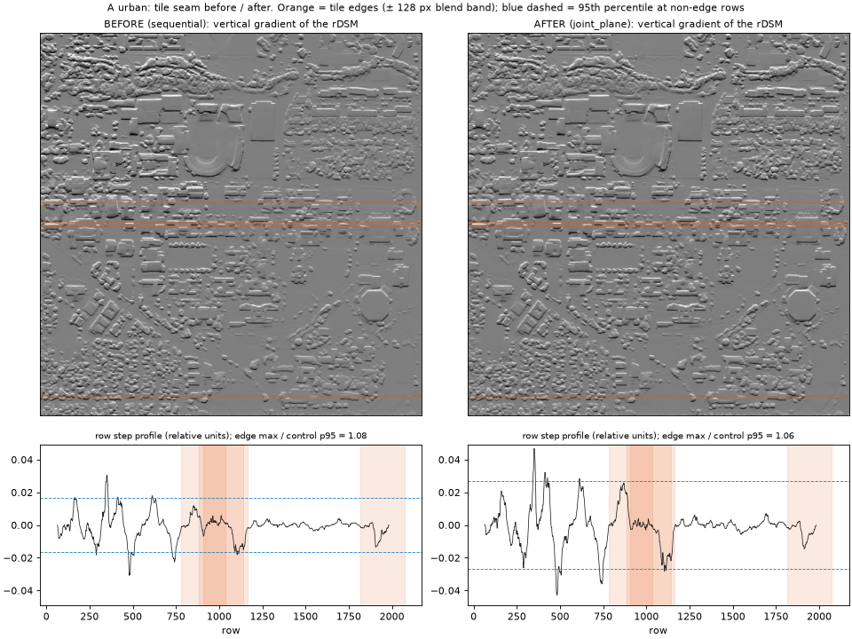
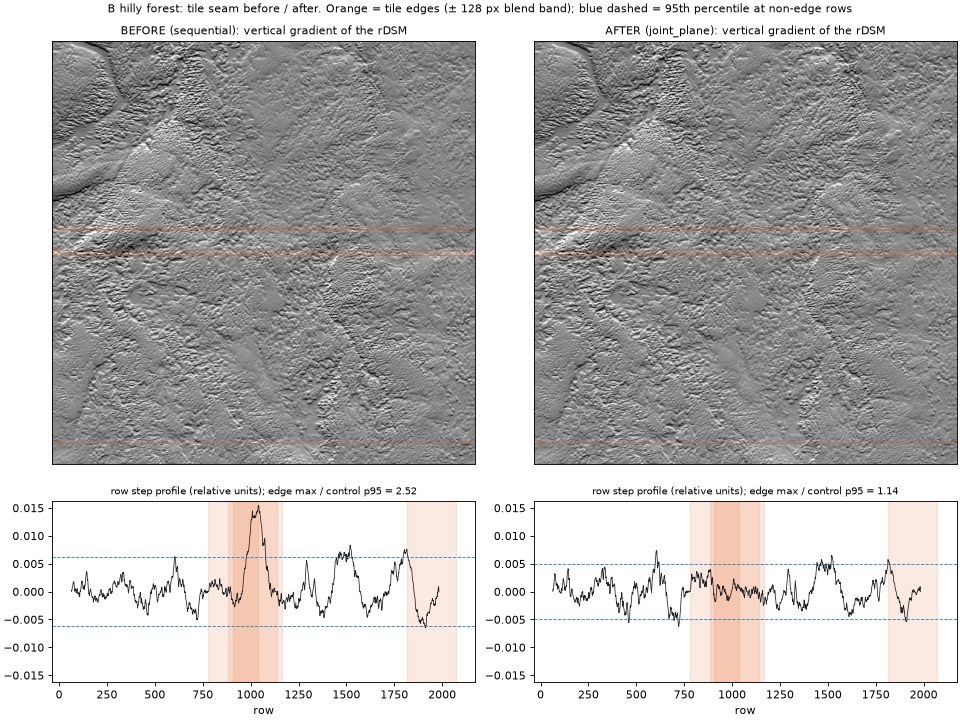
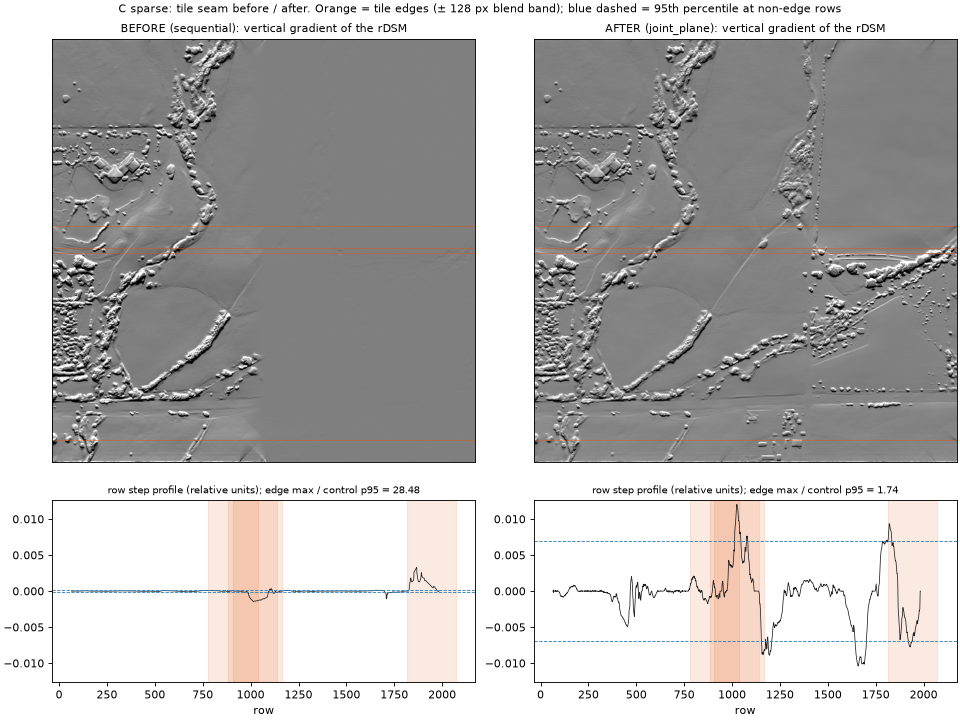

# Tile seam: diagnosis and fix (Phase 11 T3)

Source: `runs/exp11_seam/20260929T152224Z/seam_fix.json`, generated by `experiments/11_tile_seam/make_seam_report.py`. Real pipeline (DA3-Mono-Large, Copernicus, c2) on the three NAIP 0.6 m sites (2048², 9 tiles of 1036 px, 128 px overlap).

## How a seam is measured

For each row r: the median over columns of `P[r+64] − P[r−64]`, detrended with a 301-row running median to remove terrain slope. A seam is a step at the rows where a tile starts or ends. **Ratio** = largest |step| in any tile-edge band ÷ the 95th percentile at rows away from every edge. A ratio of about 1 means no seam; > 2 is a clear seam. The same statistic is computed along columns. `P` is the rDSM (relative), or the c2 detail `dsm − dem` (m).

## Results

| Site | Tile alignment | Gate | rDSM seam rows / cols | c2 detail seam rows / cols | c2 detail amplitude (m) | RMSE vs LiDAR 2 m (m) |
|---|---|---|---|---|---|---|
| A urban | sequential | passed | 1.08 / 1.08 | 1.80 / 0.71 | 1.370 | 3.242 |
| A urban | joint | passed | 1.10 / 1.04 | 1.74 / 0.72 | 1.345 | 3.254 |
| A urban | joint_plane | **failed**: scale s = -8.45 <= 0 (polarity or model failure) | – | – | – | – |
| B hilly forest | sequential | passed | 2.52 / 0.71 | 2.17 / 1.21 | 1.605 | 4.381 |
| B hilly forest | joint | passed | 1.50 / 0.85 | 1.80 / 1.20 | 1.910 | 4.391 |
| B hilly forest | joint_plane | passed | 1.14 / 0.84 | 1.79 / 1.02 | 1.454 | 4.361 |
| C sparse | sequential | passed | 28.48 / 3.38 | 6.00 / 1.49 | 0.001 | 2.128 |
| C sparse | joint | **failed**: scale s = -19.5 <= 0 (polarity or model failure) | – | – | – | – |
| C sparse | joint_plane | passed | 1.74 / 0.41 | 3.75 / 0.91 | 0.039 | 2.019 |

`sequential` = the previous method (each tile least-squares fitted to the mosaic so far). `joint` = all tiles at once: unbiased scales from spread ratios, plus offsets. `joint_plane` = `joint` plus a tilt plane per tile.

## Findings

1. **The seam was real in the relative product.** With sequential alignment the rDSM shows steps at tile edges (up to 28× the control level at the sparse site). **Joint alignment with planes removes it** (ratios 1.14–1.74 rows, 0.41–0.84 columns).
2. **Sequential alignment also erased whole tiles.** Least-squares fitting a tile to its neighbour shrinks its scale (regression dilution). At the sparse site the right-hand tiles ended up with about 4 % of tile 0's detail, and trees and field edges vanished (see the figure). The c2 detail amplitude there was 0.001 m, so the product was effectively DEM-only.
3. **In the metric product, the seam is small in metres.** At the urban and forest sites the c2 detail ratios are 0.7–2.2, close to the range at non-edge rows, because the 30 m low-pass calibration removes most of a 128 px blended step. At the sparse site the ratios are higher (3.8–6.0), but the detail there is only 1–39 mm, so the step is millimetres.
4. **The metric path is fragile for a different reason:** the detail scale `s` is fitted on the low-pass of the model output against the DEM. Changing only the tiling changed the gate outcome: `joint_plane` failed at the urban site and `joint` at the sparse site (s ≤ 0). Where they pass, the new modes are more accurate (forest −0.02 m, sparse −0.11 m RMSE), but not everywhere.

## Decision

`PipelineConfig.tile_align = "auto"`: **joint_plane for non-georeferenced input** (PNG/JPG: relative product only, no calibration, so the fix is a pure gain), and **sequential for GeoTIFF**, keeping the metric path that was validated against LiDAR. The metric seam is at texture level. The real fix is a detail-scale estimator that does not depend on low-frequency agreement (for example shadow or ICESat-2 anchors, Phase 11 T5). THIS SHOULD BE TESTED once it exists: switch GeoTIFF to joint_plane.

## Figures (rDSM: sequential = before, joint_plane = after)

How to read them: at the sparse site the BEFORE profile looks flat because the right-hand tiles were erased, not because the tiling was clean. The AFTER ratio falls partly because the restored texture raises the control level. The vertical line in the right half of the AFTER image is at column ~1320. It is a real north–south ground feature, not a column tile edge (edges are at 908 / 1012 / 1036 / 1944), and the old mosaic had erased it.

